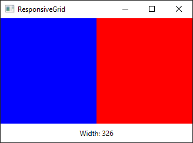

<h1 align="center">AdaptiveGrid</h1>
<p align="center">
 A powerful responsive Grid system for WPF, inspired by CSS grid. <br>AdaptiveGrid is lightweight and simple to work with, use only xaml & no code behind, build responsive layouts in seconds.
</p>
<br>

<p align="center">
  <a href="https://github.com/marplex/AdaptiveGrid/blob/main/LICENSE"></a>
  <a href="https://www.nuget.org/packages/AdaptiveGrid/"></a>
  <a href="https://www.nuget.org/packages/AdaptiveGrid/"></a>
  <a href="https://github.com/Marplex"></a> 
</p>


## 🔨 Supported framework versions

<br/>
<br/>
<br/>
<br/>
<br/>


## 🚀 Getting started

Add your grid and define rows/columns

```xml
<ag:AdaptiveGrid>

    <Grid.ColumnDefinitions>
        <ColumnDefinition Width="*" />
        <ColumnDefinition Width="*" />
    </Grid.ColumnDefinitions>

</ag:AdaptiveGrid>
```

Define your template areas inside the ```<ag:AdaptiveGrid>```
```xml
<ag:AdaptiveGrid.TemplateAreas>

    <!-- This area is applied to the layout if the width is greater than 0 -->
    <ag:AdaptiveGridTemplateArea FromWidth="0">
        <ag:AdaptiveGridTemplateArea.Areas>

            <ag:AdaptiveGridArea Area="text1" Column="0"/>
            <ag:AdaptiveGridArea Area="text2" Column="1"/>

        </ag:AdaptiveGridTemplateArea.Areas>
    </ag:AdaptiveGridTemplateArea>


    <!-- This area is applied to the layout if the width is greater than 300 -->
    <ag:AdaptiveGridTemplateArea FromWidth="300">
        <ag:AdaptiveGridTemplateArea.Areas>

            <ag:AdaptiveGridArea Area="text1" Column="1"/>
            <ag:AdaptiveGridArea Area="text2" Column="0"/>

        </ag:AdaptiveGridTemplateArea.Areas>
    </ag:AdaptiveGridTemplateArea>

</ag:AdaptiveGrid.TemplateAreas>
```

Assign corresponding areas to displayed controls

```xml
<TextBlock ag:AdaptiveGrid.Area="text1"> Text1 </TextBlock>
<TextBlock ag:AdaptiveGrid.Area="text2"> Text2 </TextBlock>
```

And that's it, Text1 and Text2 will now automatically reposition themself at column 0 or column 1 depending on the Grid's width.




## 📜 License
```xml
Copyright (c) 2022 Marco

Permission is hereby granted, free of charge, to any person obtaining a copy
of this software and associated documentation files (the "Software"), to deal
in the Software without restriction, including without limitation the rights
to use, copy, modify, merge, publish, distribute, sublicense, and/or sell
copies of the Software, and to permit persons to whom the Software is
furnished to do so, subject to the following conditions:

The above copyright notice and this permission notice shall be included in all
copies or substantial portions of the Software.

THE SOFTWARE IS PROVIDED "AS IS", WITHOUT WARRANTY OF ANY KIND, EXPRESS OR
IMPLIED, INCLUDING BUT NOT LIMITED TO THE WARRANTIES OF MERCHANTABILITY,
FITNESS FOR A PARTICULAR PURPOSE AND NONINFRINGEMENT. IN NO EVENT SHALL THE
AUTHORS OR COPYRIGHT HOLDERS BE LIABLE FOR ANY CLAIM, DAMAGES OR OTHER
LIABILITY, WHETHER IN AN ACTION OF CONTRACT, TORT OR OTHERWISE, ARISING FROM,
OUT OF OR IN CONNECTION WITH THE SOFTWARE OR THE USE OR OTHER DEALINGS IN THE
SOFTWARE.
```
